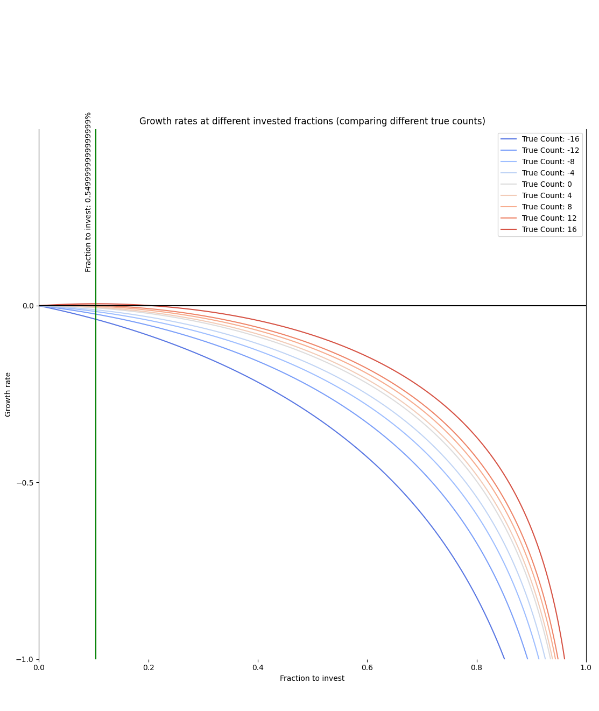

# The Kelly Criterion applied to Blackjack

See [obrhubr.org/kelly-criterion-ship-investor-blackjack](https://obrhubr.org/kelly-criterion-ship-investor-blackjack) for a full writeup.

### How to run

Run `python3 main.py`. The script requires `numpy`, `matplotlib`, `seaborn`.

You can tweak the different parameters of the simulation in `main.py`. You can change:
 - the **number of decks** played in total
 - the **number of decks** (52 cards)
 - the **reshuffling percentage**
 - the **true counts** to simulate

### How the Kelly Criterion works in Blackjack

The Kelly Criterion can be used to size the bet in more complex games, such as Blackjack. The player can get 3:2 odds on his bet if he has 21, or simple 1:1 odds for normal hands.

Blackjack’s odds vary wildly depending on which cards were revealed already. This is quantized in what’s called the true count. Since aces and tens are more favourable for the player’s odds (drawing an ace and a ten makes 21), a deck containing more of these cards increases the fraction the player should invest.

The true count being negative indicates that a lot of aces and tens have already been drawn. This being worse for the player is clearly reflected in the diagram below. The more a line is blue, the more the count is negative and the worse the growth rate is. At a positive count of 16 (which is very rare), you should invest about 0.59%.

In practice, this means that professional gamblers counting cards are betting more on tables with high counts and the allowed minimum at tables with a low count in order to maximise growth.

### The simulation

The dealer stands at a soft 17. There is no doubling down.

Since this was created to learn about the Kelly Criterion, I didn't properly implement splitting. It doesn´t actually the play the second - split off - hand. Doubling down also doesn't work because I was too lazy to implement it for this proof of concept.